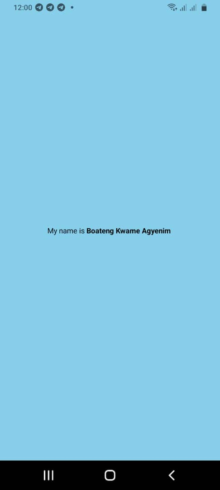
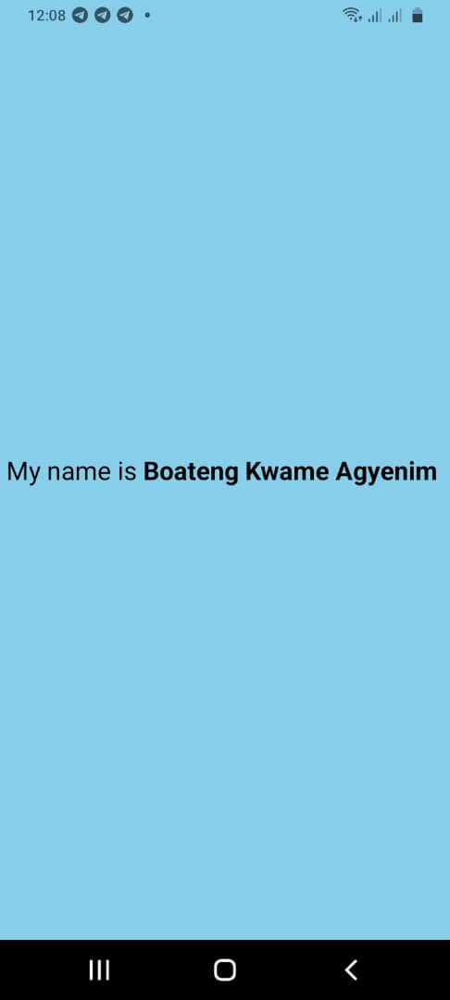

# My Application

## Description

Customize the App.js file:
Change the background color of the View component.
Modify the Text component to display the message "My name is YourName", where "YourName" should be replaced with your actual name.
Increase the font size of the text to 24.
Make the name "YourName" bold within the text.
Take a screenshot of the application displaying the modified text.
Create a README file in the project root directory containing:
A brief description of the task.
The screenshot of the application.
Your student ID.

## Student ID

My student ID is 11204907
